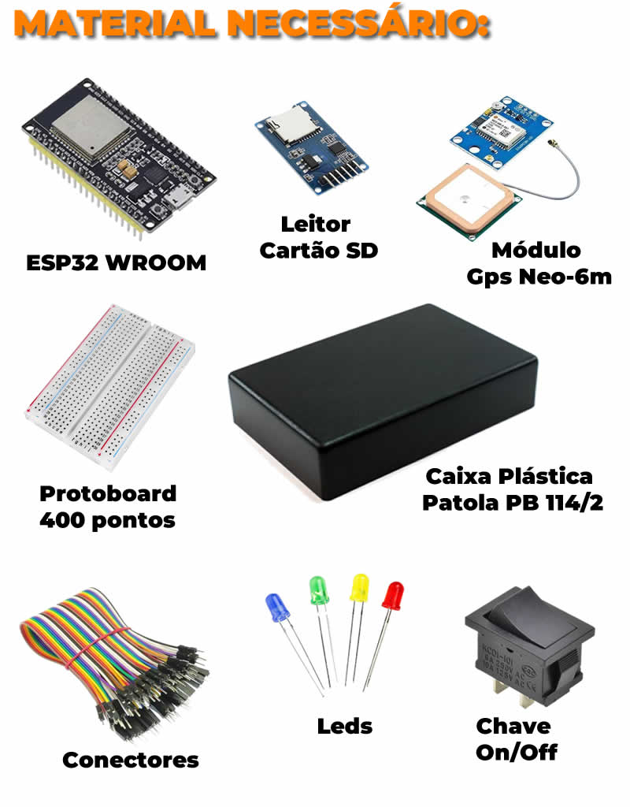
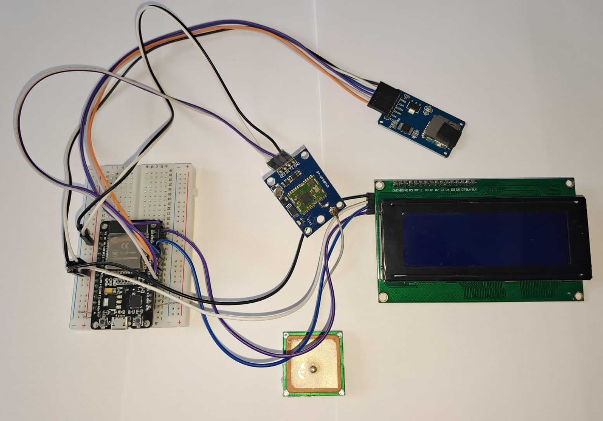

"PROJETO iNTEGRADOR IV Univesp - Polo Caçapava" 
-----------------------------------------------------------------
# BusCar GPS - Sistema de Rastreamento Veicular

 

Sistema de rastreamento GPS para veículos com armazenamento em SD card e transmissão MQTT segura, desenvolvido para o **Projeto Integrador UNIVESP - Polo CPV**.

## 📌 Visão Geral
O **BusCar** é um dispositivo embarcado que coleta dados de localização (GPS), armazena em um cartão SD e transmite via MQTT para um servidor em nuvem (HiveMQ), com interface LCD para visualização em tempo real.

### Funcionalidades
- 📡 Captura de coordenadas GPS (latitude, longitude, altitude).
- 💾 Armazenamento dos dados em formato JSON no cartão SD.
- ☁️ Transmissão segura via MQTT (com TLS) para monitoramento remoto.
- 🖥️ Interface LCD 20x4 para exibição das informações.
- 🔌 Controle por chave física (liga/desliga transmissão MQTT).

## 🛠️ Hardware Utilizado

- **Microcontrolador**: ESP32 (com WiFi e Bluetooth).
- **Módulo GPS**: Neo-6M ou similar (comunicação serial).
- **Display**: LCD 20x4 com interface I2C.
- **Armazenamento**: Cartão SD (formato FAT32).
- **Sensores/Atuadores**:
  - LED indicador de status MQTT.
  - Chave física para controle.

## 🔧 Configuração

### Pré-requisitos
- Arduino IDE ([download](https://www.arduino.cc/en/software)).
- Bibliotecas instaladas (via Library Manager):
  - `TinyGPS++`
  - `LiquidCrystal_I2C`
  - `ArduinoJson`
  - `PubSubClient`
  - `WiFiClientSecure`
  - `SD` (padrão do Arduino)

### Conexões
| Componente   | Pino ESP32 |
|--------------|------------|
| GPS (RX)     | GPIO 16    |
| GPS (TX)     | GPIO 17    |
| SD Card (CS) | GPIO 5     |
| Chave ON/OFF | GPIO 4     |
| LED MQTT     | GPIO 2     |

### Montagem

### Protótipo

🚀 Como Usar
Gravação no ESP32:

Conecte o ESP32 ao computador.

Compile e envie o código via Arduino IDE.

Operação:

Liga a chave física para ativar o MQTT.

Os dados serão exibidos no LCD e gravados no SD.

Verifique o cartão SD para ver os logs (dados_gps.json).

Monitoramento Remoto:

Acesse o broker MQTT (ex: HiveMQ Cloud) para receber os dados em tempo real.

🔧 Funcionamento
Chave ON:

LED MQTT acende fixo durante conexão e pisca quando conectado ao broker

Dados são gravados no SD e enviados via MQTT

Chave OFF:

LED apagado, dados são gravados apenas no SD

Display LCD:

Mostra ciclo de 4 páginas com dados GPS

Exibe mensagens de status

📝 Licença
Este projeto é parte do Projeto Integrador UNIVESP e está sob licença MIT.

✉️ Contato
Equipe: Grupo 8 - Projeto Integrador IV - Polo CPV - UNIVESP

Email: macspc@gmail.com